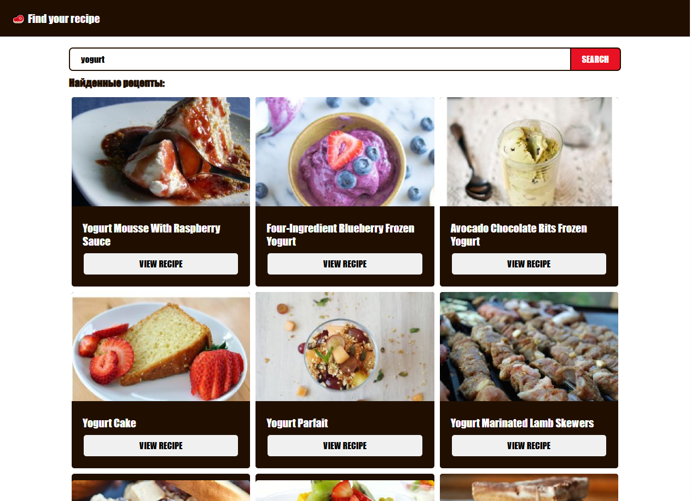
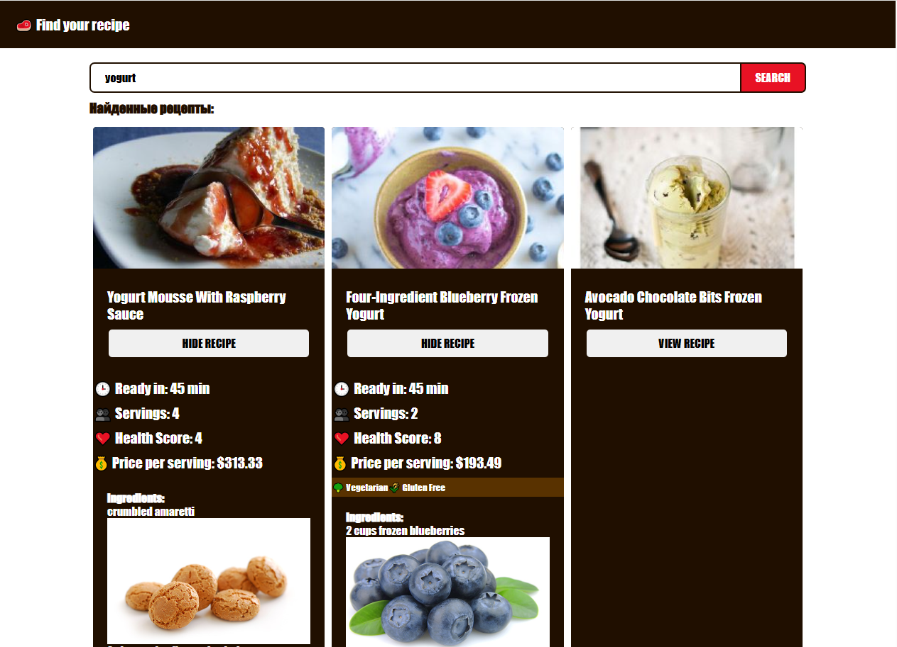

# Recipe Search App

The Recipe Search App is a user-friendly application designed to help you find recipes based on the ingredients or dishes you're interested in. This app leverages the Spoonacular API to fetch recipe data and display it in an organized manner.

## How It Works

1. **Input Your Query**: Enter the name of the ingredient or dish you want to find recipes for in the search bar.
2. **Debounced Search**: The app waits for 2 seconds after you stop typing to make an API request. This helps in reducing the number of API calls and improves performance.
3. **Fetch Recipes**: The app sends a request to the Spoonacular API with your query and retrieves a list of matching recipes.
4. **Display Results**: The retrieved recipes are displayed on the screen for you to browse through.

## Features

- **Dynamic Search**: The search functionality is dynamic and updates as you type.
- **Debouncing**: Improves performance by limiting the number of API calls.
- **Error Handling**: Gracefully handles errors and resets the results if an error occurs.

## Setup

1. **Environment Variables**: Make sure to set up your environment variables for the API key and URL.
   ```bash
   VITE_SPOONACULAR_API_KEY=your_api_key
   VITE_API_URL=your_api_url
   ```
2. **Install Dependencies**: Run `npm install` to install the necessary dependencies.
3. **Start the App**: Use `npm start` to run the app locally.

## Usage

1. Enter your search query in the input field.
2. Wait for the debounce timer to fetch recipes.
3. Browse through the list of recipes displayed.
4. View recipe and its instructions

## Stack

- React JS
- Vite

## Screenshots




